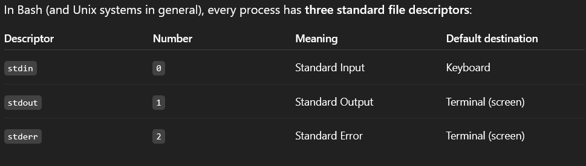

#### The command: g++ run.cpp -o run.exe compiles the file.
#### The commnad: ./run.exe 2> log.txt runs and redirects the stderr to a file named log.txt(stderr is the standard file descriptor for erros)

